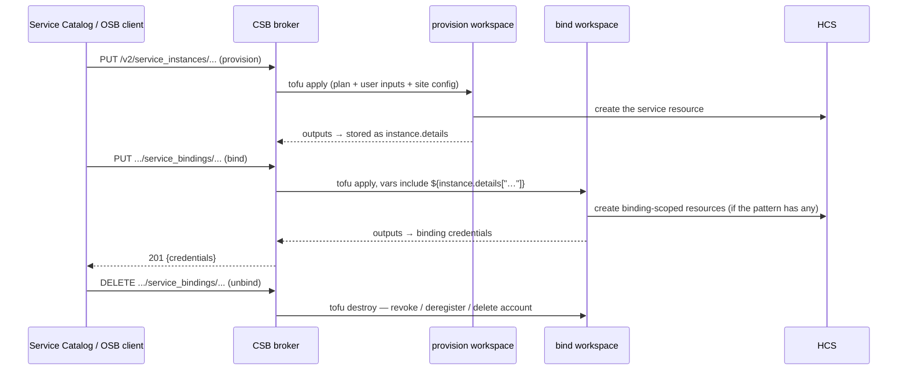
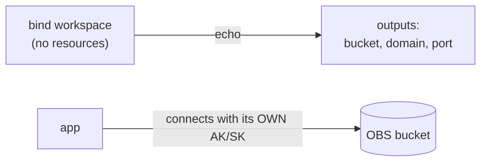
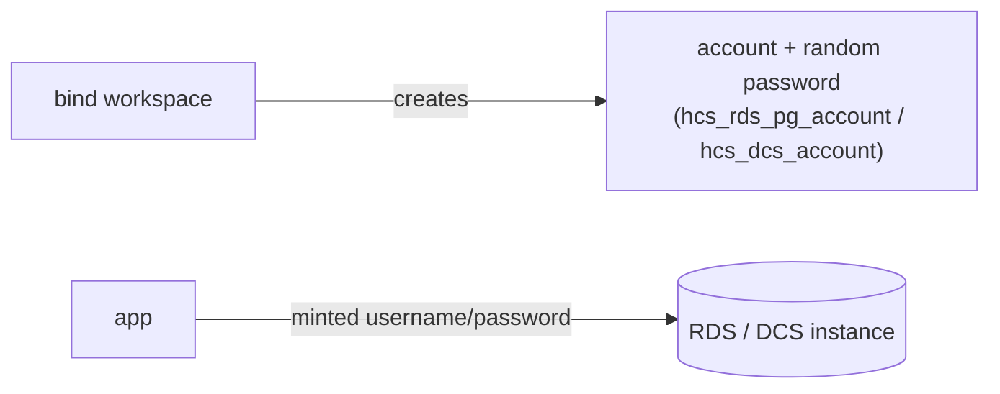
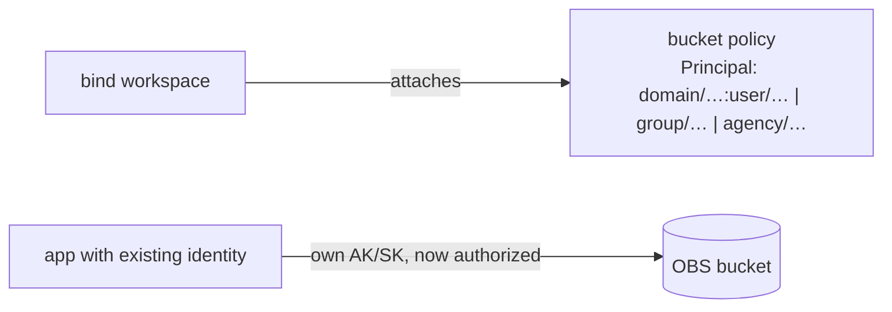
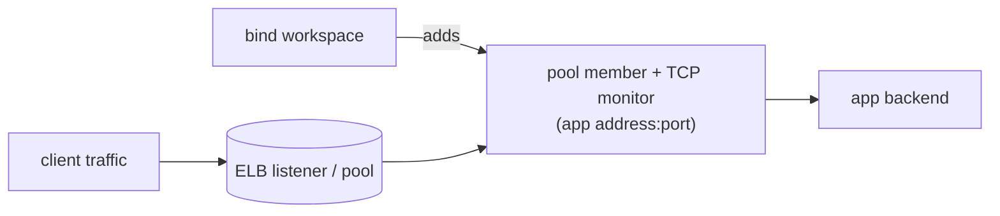
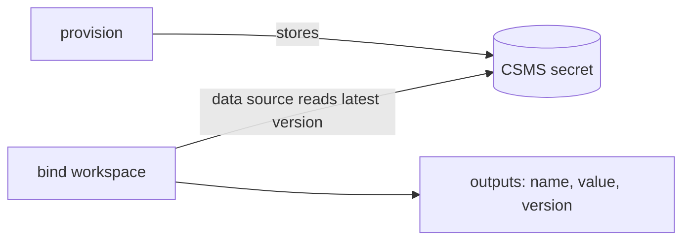
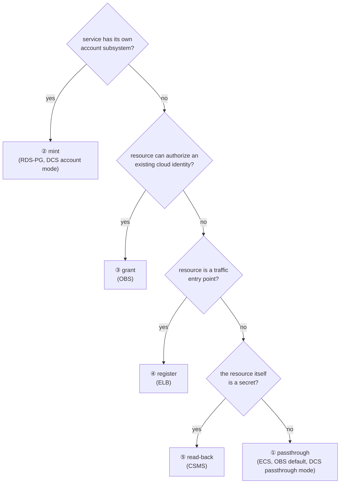

# The binding model, in pictures

Every OSB service instance has **one provision workspace** and **zero or more
bind workspaces**, each an independent tofu workspace with its own state. The
broker stitches them together with HIL: provision outputs land in
`instance.details`, and bind computed inputs read them back with
`${instance.details["..."]}`. A binding's resources live exactly as long as the
binding — unbind runs `tofu destroy` in the bind workspace.

## The five bind patterns

### ① Passthrough — hand over connection info

No bind resources. The app already owns credentials; the bind only returns
addresses.

### ② Credential minting — create an identity inside the service

The bind creates a fresh account + random secret in the service's own account
subsystem. Unbind deletes it — instant revocation.

### ③ Permission grant — authorize an existing identity

The bind attaches a policy naming a principal that already exists. No new
credential is created; unbind detaches the policy.

### ④ Backend registration — attach the consumer to an entry point

The provisioned resource fans traffic in; the bind registers the app's address
(+ health monitor) in its pool. No credentials involved.

### ⑤ Secret read-back — the resource is the credential

Provision writes (or generates) the secret; the bind reads the latest version
back out with a data source.

## Choosing a pattern

Site feature flags can force a fallback (e.g. DCS accounts need
`feature.dcs2.support.acl`; without it bind_mode falls back to passthrough).
